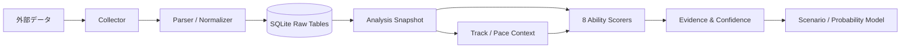

# Keiba Analyzer — 競馬予想AI（開発中）

> 競馬予想に含まれる感覚的な判断を、再現可能なデータ処理・能力評価・信頼度管理へ落とし込む個人開発プロジェクトです。

**現在開発中です。** 最終的にはレースごとの予測確率を算出するAIを目指し、現在はその前段となるデータ基盤、分析スナップショット、説明可能な能力評価エンジンを実装しています。

本リポジトリは採用ポートフォリオ向けの公開版です。Private版から、個人情報・認証情報・収集済みデータ・外部サイト固有の取得処理を除外し、設計と代表ロジックが伝わる形に再構成しています。

## 3分で確認できるポイント

1. [`docs/architecture.md`](docs/architecture.md) — データ収集から評価までの全体設計
2. [`src/keiba_analyzer/scoring/base_speed.py`](src/keiba_analyzer/scoring/base_speed.py) — 基礎スピード評価の代表実装
3. [`database/analysis_schema.sql`](database/analysis_schema.sql) — 再現性と説明可能性を意識したSQLite設計
4. [`tests/test_base_speed.py`](tests/test_base_speed.py) — 評価ロジックの単体テスト

## 解決したい課題

競馬予想では、馬場、展開、追走力、最高速度、スタミナなど多くの要素が絡み、判断基準が曖昧になりやすいという課題があります。そこで、次の流れを一つの分析基盤として構築しています。

- 2020年以降の中央競馬全レースを収集対象としてデータを蓄積
- 出走情報、過去走、通過順、上がり3F、レースラップ、個別ラップを正規化
- 馬の能力を8項目に分解し、各過去走を0〜10点で評価
- 欠損データを無理に平均値で埋めず、信頼度と評価状態を併記
- 採点根拠を保存し、結果を後から検証できるようにする

## 関連Webアプリ（稼働中）

競馬情報の確認やメモの保存を効率化するために開発したWebアプリです。

[実際に稼働しているWebアプリを見る](https://keiba-analyzer-production-fda5.up.railway.app/)

### 公開デモ用の認証情報

- ID：`keiba`
- パスワード：`keiba`

※上記はポートフォリオ閲覧用の公開デモ認証です。
個人情報や外部サービスの認証情報は含まれていません。
現在も開発・改善を継続しています。

## 能力評価の設計

評価対象は次の8項目です。

| 項目 | 評価の主眼 |
|---|---|
| 基礎スピード | 巡航速度と追走力 |
| 最高速度 | 終盤で到達できる速度 |
| スタミナ | 距離・負荷に対する持続力 |
| パワー | 重い馬場や負荷への対応力 |
| 小回り適性 | コーナーの多い条件への適応 |
| ロングスパート | 長い加速区間を維持する力 |
| ギアチェンジ | 短い区間で急加速する力 |
| 距離適性 | 対象距離への適合度 |

公開版では、実装が進んでいる**基礎スピード**の中核ロジックを、外部データやPrivate版のDBに依存しない形で掲載しています。

## 現在の実装状況

| 領域 | 状況 | 公開版での扱い |
|---|---:|---|
| レース・出走馬・過去走の収集 | 実装済み／継続改善 | サイト固有処理は非公開 |
| レースラップ・個別ラップの収集 | 実装済み／欠損対応中 | 収集済みデータは非公開 |
| SQLiteへの正規化・保存 | 実装済み | 代表スキーマを公開 |
| 分析実行のバージョン・入力固定 | 実装済み | 代表スキーマを公開 |
| 基礎スピード評価 | 実装済み／改善中 | 公開用ロジックとテストを掲載 |
| 残り7能力の評価 | 設計・実装中 | ロードマップのみ公開 |
| 馬場・展開シナリオ | 設計中 | ロードマップのみ公開 |
| 確率推定・検証 | 今後実装 | ロードマップのみ公開 |

## 基礎スピード評価の工夫

基礎スピードを単純な着順や走破時計だけで判断せず、次の要素に分けて評価しています。

- 同条件の標準ペースに対して、前半3Fがどれだけ速かったか
- 速い流れの中で、馬群のどの位置を追走できたか
- 追走後も終盤入口まで位置を維持できたか
- 個別ラップ上の減速幅が、馬場別の基準内に収まっているか
- 元データの欠損状況と、推定に依存した割合

各過去走には `MEASURED`、`ESTIMATED`、`NOT_TESTED` の状態と信頼度を付けます。最終評価では、証拠強度の高い最大5走を重み付きで集約し、中心値だけでなく上下限も保持します。

## アーキテクチャ



設計の詳細は [`docs/architecture.md`](docs/architecture.md) に記載しています。

## 公開版の実行方法

Python 3.11以上を想定しています。公開デモは標準ライブラリだけで動作します。

```bash
python -m unittest discover -s tests -v
python examples/run_demo.py
python scripts/check_public_safety.py
```

`examples/run_demo.py` は架空データのみを使用し、基礎スピードの過去走集約結果をJSONで表示します。

## 技術スタック

- Python
- SQLite
- Requests / BeautifulSoup / Selenium（Private版の収集処理）
- SQLによる分析スナップショット、制約、インデックス設計
- `unittest` による評価ロジックの検証

## 公開していないもの

安全性とデータ再配布への配慮から、次の内容は含めていません。

- 収集済みのDB、CSV、HTML、画像、ログ
- Cookie、トークン、APIキー、ブラウザプロファイル
- 実名、メールアドレス、学校情報、端末内のユーザーフォルダ
- 外部サイト固有のURL、セレクタ、アクセス手順の詳細
- Private版の全ソースコード

公開方針は [`docs/publication_policy.md`](docs/publication_policy.md) にまとめています。

## 今後の予定

- 残り7能力の採点ロジックを実装
- 馬場状態と展開シナリオを能力評価へ接続
- 過去レースを用いた時系列バックテスト
- 予測確率の較正と、モデルバージョンごとの比較
- 分析根拠を確認できるWeb UIまたはAPIの実装

詳細は [`docs/roadmap.md`](docs/roadmap.md) を参照してください。

## 注意事項

本プロジェクトは学習・研究目的の個人開発です。特定の投票行動や利益を保証するものではありません。外部データの権利は各権利者に帰属し、本リポジトリでは収集データを配布していません。
