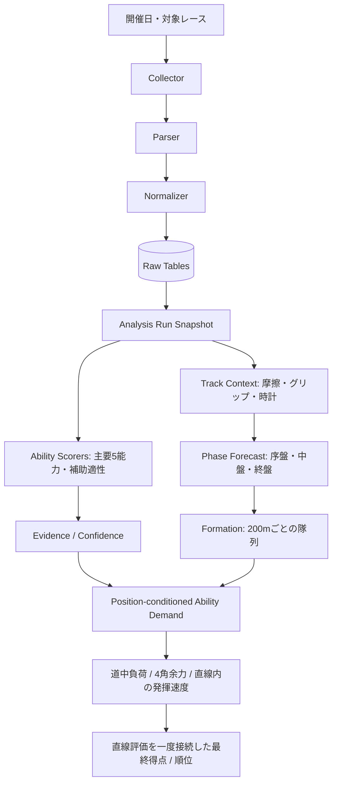

# アーキテクチャ

## 1. 全体像

Private版では、収集・整形・保存・分析を分離しています。外部ページの構造変更や欠損が発生しても、影響範囲を限定し、処理単位で原因を確認できるようにするためです。

## 2. データ層

### Raw tables

- `races`: レース単位の条件
- `horses`: 競走馬の識別情報
- `results`: 着順、斤量、通過順、上がり3Fなど
- `race_laps`: レース全体の区間ラップ
- `horse_laps`: 馬ごとの個別区間ラップ

### Analysis tables

- `model_versions`: 採点・馬場・展開ロジックの版管理
- `analysis_runs`: 1回の分析単位、データ締切、乱数シード
- `run_entries`: 分析時点の出馬表スナップショット
- `analysis_source_races`: 各馬の評価に使った過去走
- `past_run_ability_scores`: 過去1走×能力の点数
- `ability_evidence`: 点数を構成した根拠
- `horse_ability_estimates`: 馬ごとの集約能力値
- `ability_input_fingerprints`: 能力別の入力・ロジック指紋
- `max_speed_expression_profiles`: 絶対最高速と余力―速度曲線
- `prediction_cache_revisions`: 予想キャッシュの入力世代

## 3. 再現性

同じ対象レースでも、後日データが更新される可能性があります。そのため、分析時には次を固定します。

- モデルバージョン
- データの締切時刻
- 入力スナップショットのハッシュ
- 対象馬と斤量・騎手等の出馬表情報
- 採用した過去走
- シミュレーション用の乱数シード

同じ対象レースは安定した表示番号で管理し、再計算時は最新結果へ更新します。一方、入力指紋・能力計算ロジック指紋・予想ロジック指紋を保存し、更新理由を追跡できる設計です。能力ごとに依存ファイルと入力データの指紋を持つため、ロジック変更がない能力は再利用し、変更された能力だけを再計算できます。

## 4. 欠損データの扱い

欠損を一律に0点や平均値へ置き換えると、能力不足とデータ不足を区別できません。そこで評価状態を分けます。

- `MEASURED`: 必要な主要データが揃い、直接評価できた
- `ESTIMATED`: 一部を代替データから推定した
- `NOT_TESTED`: 評価に必要な根拠が不足した

点数とともに信頼度・上下限・根拠を保存し、後から評価理由を確認できるようにしています。

レース内相対評価では、対象馬だけ個別ラップが揃っていると主馬群を誤判定します。そのため必要な出走馬のラップを一括確認し、欠損を再取得します。欠損と能力不足は同義ではありません。上の状態名は公開例の契約で、本番の能力別状態・補完可否は別に管理します。

## 5. 基礎スピードの代表ロジック

Private版では、次の流れで評価します。

1. 実際の区間距離を保持した補正後ラップから巡航とレース全体の流れを確認
2. 同レース全体の個別ラップから主馬群への接続を判定
3. 前受け・中団・離れた後方を分け、実際に受けたペース圧を計算
4. 追走できた区間は成功証拠、流れから外れた区間は失敗証拠へ分類
5. 距離変更は非対称に移送し、長距離の遅い巡航を短距離へそのまま持ち込まない
6. 終盤失速も確認し、能力別の証拠採用・集約ルールで値と根拠を保存

公開用の `base_speed.py` は初期の設計説明用です。前半600mの分類や固定段階点は、現行アプリの全体ラップ評価を再現しません。本番と同じ得点が出ると誤解しないよう、過去の簡略例として明示しています。

## 6. 最高速度の二層化

最高速度には二つの値を持たせます。

- **絶対最高速の能力値**: 対象距離への移送を含む能力計算の出力。表示・予想入力で保持し、直線に入る前に負荷を理由として書き換えない
- **今回発揮最高速**: 直線到達モデル内で、絶対能力、基礎スピード、スタミナ、道中負荷、残存余力、馬場を使って求める実行結果

以前の独立した余力曲線による発揮点は、現行の予想では補助診断であり、順位用の能力マップへ事前適用しません。公開用 `max_speed_expression.py` はこの旧案の設計履歴です。0〜10点の能力尺度、m/sの速度、秒の到達時間を同じ数値として乗算しません。

## 7. 馬場・展開・位置別能力要求

予想では全馬に同じ能力比率を掛けません。生の摩擦とグリップを物理条件として使い、予測した中盤の緩み・継続流・終盤再加速から8種類の基本レース質へ分類します。

- 低摩擦・高グリップで緩む: 最高速度とギアチェンジ
- 低摩擦・高グリップで流れる: 最高速度とロングスパート
- 高摩擦で流れる: 基礎スピード、スタミナ、ロングスパート
- 低グリップ: 基礎スピードとロングスパートを中心に、補助適性で発揮率を調整

さらにスタート直後・中盤・4角の予想位置を使って、区間ごとの能力要求を作ります。公開の分類・比率表は代表例で、現行の本番係数そのものではありません。

決定済み展開を `phase_contract.py` で共通化し、画面の終盤開始位置と負荷計算の開始位置を一致させます。コース事前分布より、今回決定した展開を優先します。直線に入った後は残距離の区間だけを切り出し、道中区間をもう一度足しません。

## 8. 逃げ馬・隊列予測

隊列はラップの実距離を基準に、初速、二の足、基礎スピード、枠、隣接馬、コース形状から更新します。1500m・1700mなどの100m始まりは `lap_checkpoint.py` で距離を合わせます。区間途中の時計は `INTERPOLATED` とし、実測端点の `MEASURED` と区別します。逃げ馬は次の二つを分けます。

- `physical reach`: スタート後のラップから先頭へ到達できるか
- `lead conversion`: 到達可能だった過去走で、実際に先頭を選んだ割合

これにより、初速が速くても通常は控える馬を逃げ馬と誤認しにくくします。明確な逃げ馬がいない場合は「逃げ役不在」を一つの状態として保持し、中盤は原則緩む方向へ置きます。先行競合、番手圧、まくりなど、独立したラップ圧が十分な場合だけ持続流へ変更します。

## 9. 直線到達モデル

4角順位をそのまま最終順位にせず、前方馬と後方馬を比較し、次を統合して直線所要時間と追い抜き可否を計算します。

- 4角での予想位置差と残存余力
- 最高速度、ギアチェンジ、ロングスパート
- ペース・位置・外回し・斤量による負荷
- 基礎スピードとスタミナによる負荷吸収
- 馬場グリップによる加速能力の発揮率

低負荷の高速持続戦では今回発揮最高速度とロングスパート、高負荷の継続戦では基礎スピードとスタミナを中心にします。基礎スピードが低い馬は必ずしも道中で徐々に順位を下げるとは限らないため、隊列を維持するために余計な負荷を受け、直線の発揮値が低下する形でも表現します。

**稼働版の最終順位は、直線到達時間だけの並べ替えではありません。** 展開・条件・能力証拠からの得点に、信頼度付きの直線到達評価を一度接続します。直線順位の別途融合や、その後の能力加点を重ねる二重評価を避けています。直線時間を最終順位の主権にする開発中の別案を、この公開版で実運用済みとは記載しません。

## 10. 性能とジョブ制御

- レースを開いた時点で不足データを確認し、有効期間内は予想開始時の重複確認を省略
- 能力別指紋により変更能力だけを再計算
- 過去走・補正分布・コース条件を一括読込し、馬ごとの同一SQLを削減
- 不変な経験モデルを予想ケース間で共有し、出力JSONの完全一致をテスト
- ログインとレースをキーにジョブ状態を分離し、複数予想の並行実行と安全な停止に対応

## 11. 公開版とPrivate版の境界

公開版は設計と代表ロジックの確認を目的とします。サイト固有の取得処理、認証状態、収集済みデータ、運用ログは含めません。これにより、個人情報や認証情報の流出、第三者データの再配布を防ぎます。

## 12. バックテストと版の境界

能力計算・馬場分析・予想エンジンの指紋を区別し、対象レースより後の情報を入力に混ぜません。対象の結果は予想を固定した後で答え合わせに使います。現在の検証対象は2025年以降、芝1600m以上、13頭以上、1勝クラス以上です。

主指標は予想上位5頭の三連複BOX。馬連5頭BOX、ワイド3頭BOX、予想と実際の上位3頭の集合一致（3ビタ、順不同）も確認します。取得不能・評価不能を不的中に混ぜず、各指標の分母を保存します。途中の100R検証を完了実績として公表しません。キャッシュ高速化など未配備の作業は[同期記録](deployed_sync.md)で稼働版と分離します。
