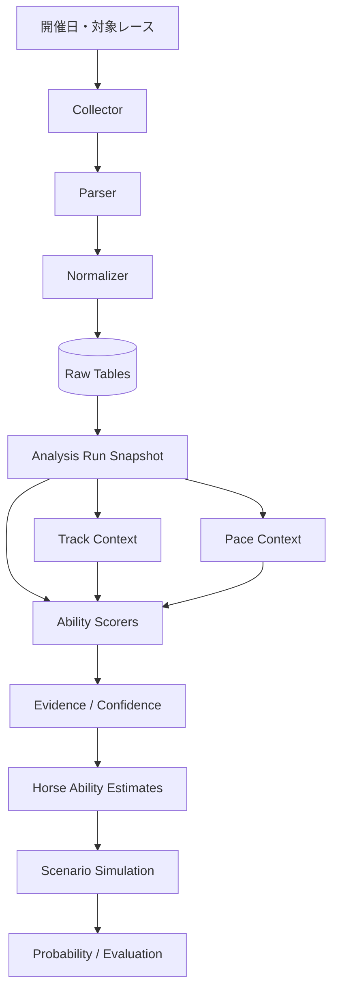

# アーキテクチャ

## 1. 全体像

Private版では、収集・整形・保存・分析を分離しています。外部ページの構造変更や欠損が発生しても、影響範囲を限定し、処理単位で原因を確認できるようにするためです。

## 2. データ層

### Raw tables

- `races`: レース単位の条件
- `horses`: 競走馬の識別情報
- `results`: 着順、斤量、通過順、上がり3Fなど
- `race_laps`: レース全体の区間ラップ
- `horse_laps`: 馬ごとの個別区間ラップ

### Analysis tables

- `model_versions`: 採点・馬場・展開ロジックの版管理
- `analysis_runs`: 1回の分析単位、データ締切、乱数シード
- `run_entries`: 分析時点の出馬表スナップショット
- `analysis_source_races`: 各馬の評価に使った過去走
- `past_run_ability_scores`: 過去1走×能力の点数
- `ability_evidence`: 点数を構成した根拠
- `horse_ability_estimates`: 馬ごとの集約能力値

## 3. 再現性

同じ対象レースでも、後日データが更新される可能性があります。そのため、分析時には次を固定します。

- モデルバージョン
- データの締切時刻
- 入力スナップショットのハッシュ
- 対象馬と斤量・騎手等の出馬表情報
- 採用した過去走
- シミュレーション用の乱数シード

既存結果を上書きせず、新しい `analysis_run_id` を作ることで、変更前後を比較できる設計です。

## 4. 欠損データの扱い

欠損を一律に0点や平均値へ置き換えると、能力不足とデータ不足を区別できません。そこで評価状態を分けます。

- `MEASURED`: 必要な主要データが揃い、直接評価できた
- `ESTIMATED`: 一部を代替データから推定した
- `NOT_TESTED`: 評価に必要な根拠が不足した

点数とともに信頼度・上下限・根拠を保存し、後から評価理由を確認できるようにしています。

## 5. 基礎スピードの代表ロジック

公開版の `base_speed.py` では、次の考え方を確認できます。

1. 同条件の標準前半3Fと比較してペースを分類
2. ペースと馬群内の位置から追走力を評価
3. 序盤から終盤入口までの位置維持を評価
4. 終盤の最大減速を馬場・先行負荷で補正
5. 過去走の点数と信頼度から証拠強度を計算
6. 証拠強度上位5走を重み付きで集約

公開用コードは、レビューしやすいようにDBアクセスを外し、純粋関数中心に再構成しています。

## 6. 公開版とPrivate版の境界

公開版は設計と代表ロジックの確認を目的とします。サイト固有の取得処理、認証状態、収集済みデータ、運用ログは含めません。これにより、個人情報や認証情報の流出、第三者データの再配布を防ぎます。
